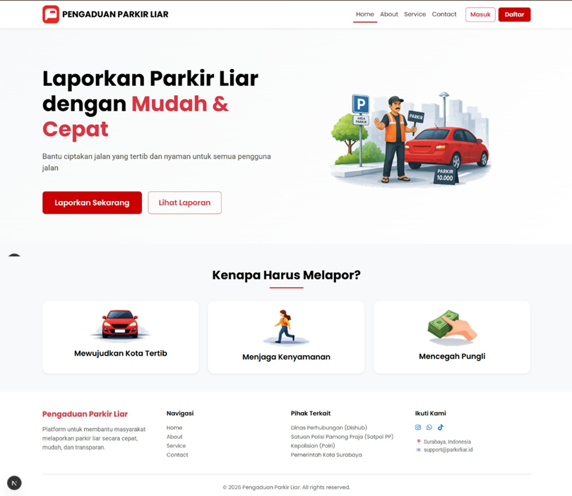

# 🚗 Sistem Pengaduan Parkir Liar

<p align="center">
  <b>Platform pelaporan parkir liar berbasis web dengan sistem real-time, peta interaktif, dan dashboard modern</b>
</p>

<p align="center">
  <a href="https://sistempengaduanparkirliar.vercel.app">
    
  </a>
  
  
  
  
</p>

---

## 📌 Overview

Sistem ini dirancang untuk membantu masyarakat dalam melaporkan pelanggaran parkir liar secara digital dengan proses yang cepat, transparan, dan terintegrasi.

💡 Fitur utama:
- Pelaporan berbasis lokasi (map)
- Upload foto bukti
- Dashboard statistik interaktif
- Monitoring status laporan secara real-time

---

## 🖼️ Preview

<p align="center">
  
</p>

---

## 🌐 Live Demo

🔗 https://sistempengaduanparkirliar.vercel.app  

---

## ✨ Features

### 📍 Smart Reporting System
- Input data pelapor
- Integrasi peta (Leaflet)
- Upload foto bukti
- Deskripsi laporan

---

### 🗺️ Interactive Map
- Visualisasi semua laporan
- Marker berbasis lokasi
- Navigasi mudah

---

### 📊 Analytics Dashboard
- Total laporan
- Status laporan (menunggu, diproses, selesai)
- UI modern (glassmorphism + gradient)

---

### 📄 Dynamic Detail Page
```
/laporan/[id]
```

- Detail lengkap laporan
- Tampilan responsif
- Data real-time

---

### ⚡ Real-time Sync
- Data langsung dari Supabase
- Update tanpa reload

---

## 🧠 Tech Stack

| Category | Technology |
|--------|------------|
| Frontend | Next.js, React |
| Backend | Supabase |
| Styling | Bootstrap 5 |
| Map | Leaflet |
| Deployment | Vercel |

---

## 🏗️ Project Structure

```bash
src/
├── app/
├── components/
├── data/
├── lib/
└── styles/
```

---

## ⚙️ Environment Setup

```env
NEXT_PUBLIC_SUPABASE_URL=your_url
SUPABASE_SERVICE_ROLE_KEY=your_key
```

---

## 🚀 Getting Started

```bash
git clone https://github.com/username/repository.git
cd repository
npm install
npm run dev
```

Open:
```
http://localhost:3000
```

---

## 🚀 Deployment

Deploy menggunakan **Vercel**

✔ Auto deploy saat push ke GitHub  
✔ Build cepat & stabil  

---

## 📊 Roadmap

- [ ] Authentication (Login & Register)
- [ ] Admin Dashboard
- [ ] Edit & Delete Laporan
- [ ] Filter & Search
- [ ] Notification System

---

## 🤝 Contributing

Kontribusi sangat terbuka!

1. Fork repository  
2. Buat branch baru  
3. Commit perubahan  
4. Pull Request  

---

## 👨‍💻 Team

**Kelompok 22 – Studi Independen PT VINIX7 AURUM**  
💼 Divisi: Web Development & UI/UX  

| Nama | Peran |
|-----|------|
| Miftachul Rizqi | Developer |
| Muhammad Ilham Mushidiq | Developer |
| Mochammad Roudho Brammastyo | Developer |

---

## ⭐ Support

Jika project ini membantu:

⭐ Star repository ini  
📢 Share ke teman  

---

## 📄 License

Project ini dibuat untuk keperluan pembelajaran dan pengembangan sistem.